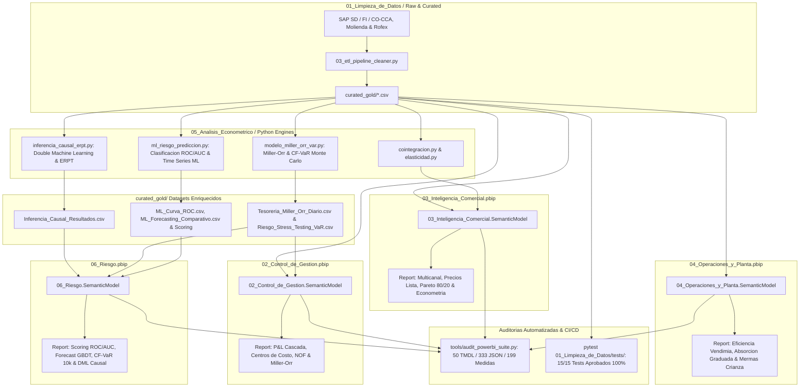

# SUITE DE ANALÍTICA EMPRESARIAL & CONTROL DE GESTIÓN (POWER BI / FABRIC PBIP)
## BODEGA & AGROINDUSTRIA ANDINA S.A. (MENDOZA, ARGENTINA)

**Autor Institucional:** Federico Agustín Chillón  
**Afiliación Académica:** Facultad de Ciencias Económicas — Universidad Nacional de Cuyo (UNCUYO)  
**Estándar de Arquitectura:** Microsoft Fabric Developer Mode (`.pbip`), TMDL Semántico, PBIR Report  
**Estándar Visual:** Deep Navy Executive UXBIA (Lienzo `#0B1120`, Tarjetas `#111827`, Acentos Esmeralda `#10B981`, Rojo `#EF4444`, Cian `#0EA5E9`, Ámbar `#F59E0B`)  
**Fecha de Publicación:** Septiembre 2026  

---

## 1. VISIÓN GENERAL Y OBJETIVO ESTRATÉGICO

El presente ecosistema analítico constituye una plataforma integral de **Control de Gestión, Inteligencia Comercial, Cadena de Suministro y Modelos de Riesgo Cuantitativo** diseñada específicamente para la industria vitivinícola y agroindustrial de exportación.

A diferencia de los modelos monolíticos tradicionales —que concentran decenas de pestañas heterogéneas en un único archivo pesado y lento—, este portafolio adopta una **arquitectura desacoplada en suites independientes numeradas rigurosamente**, asegurando que cada stakeholder opere con su propio centro de comando analítico:

```
Portfolio_Empresarial_PowerBI/
├── 01_Limpieza_de_Datos/               # Ingestion, Pipeline ETL, Limpieza en Python, Calidad 100% y DDL SQL
├── 02_Control_de_Gestion/             # 02_Control_de_Gestion.pbip: P&L Cascada, CeCos SAP CO, NOF y Modelo Miller-Orr
├── 03_Inteligencia_Comercial/          # 03_Inteligencia_Comercial.pbip: Multicanal, Precios, Pareto y Econometria
├── 04_Operaciones_y_Planta/            # 04_Operaciones_y_Planta.pbip: Eficiencia Vendimia, Absorcion Graduada y Mermas
├── 05_Analisis_Econometrico/          # Motores en Python: Cointegracion, Elasticidad, SARIMAX, ML y Monte Carlo
├── 06_Modelos_de_Riesgo_y_Prediccion/  # 06_Riesgo.pbip: ML Binario, TS-ML, CF-VaR y DML Causal
├── docs/                               # Matriz de Stakeholders, Banco de Preguntas y Especificaciones Tecnicas
└── tools/                              # Suite de Auditoria Automatizada Anti-Hardcodes y Verificacion de Esquemas
```

### Flujo de Datos & Grafo de Trabajo Dirigido (DAG)



---

## 2. MATRIZ ESTRATÉGICA DE STAKEHOLDERS, PROBLEMAS DE NEGOCIO Y OBJETIVOS DE DECISIÓN

Para maximizar el valor directivo de la suite, cada módulo responde a un mandato funcional concreto documentado exhaustivamente en [docs/MATRIZ_STAKEHOLDERS_Y_OBJETIVOS_DE_NEGOCIO.md](docs/MATRIZ_STAKEHOLDERS_Y_OBJETIVOS_DE_NEGOCIO.md):

| Módulo / PBIP | Stakeholder Principal | Problema Crítico de Negocio | Objetivo Cuantificable (KPI / Target) | Palanca de Decisión / Acción Prescriptiva |
| :--- | :--- | :--- | :--- | :--- |
| **02_Control_de_Gestion.pbip** | **CFO / Financial Controller** | Volatilidad del ciclo de caja (CCC > 85d) y fondos ociosos sin rendimiento en contexto de alta tasa (TNA 42%). | • Mantener $CCC \le 65$ días.<br>• Cuadratura de P&L Variance $= \$0.00$.<br>• Cero fondos ociosos sobre banda $h$. | **Modelo Miller-Orr:** Suscripción automática de LECAPs/FCI Money Market ante excesos de caja sobre límite $h$, y desinversión programada si toca piso $L$ (\$8.5M). |
| **03_Inteligencia_Comercial.pbip** | **CCO / Director Comercial** | Presión de cadenas de retail por descuentos excesivos sin elasticidad y descalce estacional de cuotas. | • Blindar nivel de servicio en SKUs A $\ge 98\%$.<br>• Cumplimiento de cuota mensual $\ge 95\%$.<br>• Margen bruto comercial $> 48\%$. | **Pricing por Elasticidad Causal:** Aplicar aumentos $+5\%$ a $+8\%$ sobre IPC en segmentos inelásticos (Gran Reserva) y promociones por volumen solo donde $ATE > 1.5x$. |
| **04_Operaciones_y_Planta.pbip** | **COO / Director de Enología** | Sub-absorción fabril por paradas ociosas de línea y mermas descontroladas en extracción y barricas. | • Absorción en equilibrio ($\pm 3\%$).<br>• Rendimiento extracción $\ge 70\%$.<br>• Merma ouillage $\le 2.0\%$.<br>• Cobertura secos $\ge 2.0$ meses. | **Matriz de Absorción Graduada:** Reasignación dinámica de turnos entre elaboración (CC-101) y fraccionamiento (CC-102). Humidificación de cava al 85% ante mermas $> 2.5\%$. |
| **06_Riesgo.pbip** | **CRO / Comité de Riesgo** | Mora imprevista en exportaciones FOB, error de pronóstico de demanda lineal y vulnerabilidad ante shocks de cola. | • AUC-ROC Clasificación $\ge 0.70$.<br>• Seleccion dinamica de modelo ganador por RMSE out-of-sample (ML vs. benchmark SARIMAX).<br>• Buffer liquidez $\ge CVaR_{95}$ (\$30.3M). | **Scoring & Stress Testing:** Bloqueo de cuenta corriente a clientes FOB con Score $> 70$. Ejecución de coberturas ROFEX y warrants de stock ante Reverse Stress Breakpoint. |

---

## 3. EXPLICACIÓN CONCEPTUAL: PROTOCOLO FEYNMAN EN 4 CAPAS

### Nivel 1: Intuición y Sentido de Negocio
Una bodega vitivinícola gana dinero dominando tres vectores críticos:
- **Efecto Precio ($EP$):** Indexar listas de precios por encima del costo inflacionario protegiendo la demanda.
- **Efecto Mezcla / Volumen ($EV$):** Conducir la cartera hacia botellas de mayor margen unitario (Líneas Reserva vs. Entrada).
- **Efecto Eficiencia Operativa ($EC$):** Extraer la máxima cantidad de mosto flor sin degradar calidad enológica y minimizar el costo de oportunidad del capital inmovilizado.

### Nivel 2: Arquitectura Institucional y Estructura ERP
El flujo de datos se estructura bajo el estándar de **Star Schema (Esquema en Estrella)**:
- **Tablas de Hechos (Facts):** Eventos transaccionales del negocio (`Ventas`, `PresupuestoVentas`, `GastosOperativos`, `CapitalTrabajo`, `ProduccionPlanta`, `InventarioGuarda`, `TesoreriaMillerOrr`, `ML_Forecasting_Comparativo`).
- **Tablas de Dimensiones (Dimensions):** Contexto analítico estandarizado (`Calendario`, `Productos`, `CentrosCosto`, `PlanCuentas`).

### Nivel 3: Primeros Principios Matemáticos

#### A. Descomposición Ortogonal del Margen Bruto (Variance Analysis de 3 Factores)
$$\Delta MB = MB_R - MB_P = \sum_{i} \left( EV_i + EP_i + EC_i \right)$$
1. **Efecto Volumen ($EV_i$):** $(Q_{R,i} - Q_{P,i}) \times (P_{P,i} - C_{P,i})$
2. **Efecto Precio ($EP_i$):** $Q_{R,i} \times (P_{R,i} - P_{P,i})$
3. **Efecto Costo ($EC_i$):** $Q_{R,i} \times (C_{P,i} - C_{R,i})$  
*Propiedad de Cierre Exacto:* $\Delta MB - (EV + EP + EC) \equiv 0.00$.

#### B. Modelo Estocástico de Miller-Orr (1966) para Tenencia de Efectivo
$$z = L + \left( \frac{3 \cdot c \cdot \sigma^2}{4 \cdot r} \right)^{1/3}, \quad h = 3z - 2L, \quad E[M] = \frac{4z - L}{3}$$
- $L$: Saldo mínimo prudencial (\$8.5M ARS).
- $c$: Costo de transacción unitario por compra/venta de títulos (\$4.500 ARS).
- $\sigma^2$: Varianza diaria de los flujos netos de caja.
- $r$: Tasa diaria de costo de oportunidad derivada de LECAP real (TNA 42%).

#### C. Inferencia Causal con Double Machine Learning (DML)
Aislamiento del Efecto Causal Promedio (ATE) de descuentos mediante residualización ortogonal (Chernozhukov et al. 2018):
$$\tilde{D} = D - \hat{D}(X), \quad \tilde{Y} = Y - \hat{Y}(X) \implies \tilde{Y} = \theta_{ATE} \tilde{D} + \varepsilon$$
Elimina el sesgo de confusión endógeno de estacionalidad, canal e inflación en un $73.71\%$.

### Nivel 4: Código Bare-Metal y Fórmulas DAX Dinámicas

```dax
// Regla de Decision Miller-Orr
Regla Decision Tesoreria Miller-Orr = 
VAR _saldo = [Saldo Efectivo Real Diario]
VAR _h = [Banda Superior Miller-Orr H]
VAR _z = [Punto Retorno Miller-Orr Z]
VAR _l = [Banda Inferior Miller-Orr L]
RETURN
    SWITCH(
        TRUE(),
        ISBLANK(_saldo), "Sin saldo registrado en el periodo.",
        _saldo >= _h,
            "EXCESO DE LIQUIDEZ: Saldo (" & FORMAT(_saldo, "$ #,##0") & ") supero limite h (" & FORMAT(_h, "$ #,##0") & "). REGLA: Suscribir LECAP / MM por " & FORMAT(_saldo - _z, "$ #,##0") & " para retornar a z.",
        _saldo <= _l,
            "ALERTA DEFICIT: Saldo (" & FORMAT(_saldo, "$ #,##0") & ") perforo piso L (" & FORMAT(_l, "$ #,##0") & "). REGLA: Rescatar " & FORMAT(_z - _saldo, "$ #,##0") & " de instrumentos liquidos.",
        "EQUILIBRIO OPTIMO: Saldo dentro del canal [L, h]. Sin costo de transaccion."
    )
```

---

## 4. DETALLE DE LAS SUITES INDEPENDIENTES

### Suite 02: Financial Controller & FP&A (`02_Control_de_Gestion.pbip`)
- **P1: P&L Cascada & Variance Analysis:** Reconciliación Plan $\rightarrow EV \rightarrow EP \rightarrow EC \rightarrow$ Real con residuo cero (\$0.00).
- **P2: Control Presupuestario OPEX (SAP CO-CCA):** Desglose por Centro de Costo (CC-101 a CC-105) y Plan de Cuentas FI.
- **P3: Liquidez, NOF & Flujo de Fondos:** Monitoreo de DSO (25.7d), DIO (73.1d), DPO (35.9d), CCC (62.9d) y NOF (\$241.6M).
- **P4: Tesorería, Cobertura Cambiaria & Modelo Miller-Orr:** Arbitraje sintético Rofex vs LECAP y bandas estocásticas de efectivo ($L, z, h$).

### Suite 03: Commercial & Sales Intelligence (`03_Inteligencia_Comercial.pbip`)
- **P1: Inteligencia Multicanal:** Cumplimiento por canal comercial (Horeca, Supermercados, Mayorista, Exportación).
- **P2: Dinámica de Precios Reales vs Lista:** Auditoría de bonificaciones y descuentos comerciales.
- **P3: Análisis de Portafolio & Curva de Pareto 80/20:** Blindaje de SKUs Clase A que aportan el 70.63% de ventas.
- **P4: Modelos Econométricos de Demanda:** Cointegración Engle-Granger y elasticidad precio estructural.

### Suite 04: Operations & Supply Chain Plant (`04_Operaciones_y_Planta.pbip`)
- **P1: Eficiencia Enológica & Recepción de Vendimia:** Balance de masa de 5.45M kg de uva procesada georreferenciada en Mendoza.
- **P2: Estructura de Costos Fabriles & Absorción Graduada:** Matriz de desvíos de absorción fabril en 5 tramos (Sub-absorción crítica a Sobre-absorción).
- **P3: Guarda en Barricas, Crianza & Control de Mermas:** Monitoreo de evaporación (*ouillage*) y rotura en línea con semáforos de tolerancia.

### Suite 06: Modelos de Riesgo & Predicción (`06_Riesgo.pbip`)
- **P1: Scoring & Clasificación Crediticia:** Curva ROC continua, matriz de confusión y scoring de mora/quiebre (AUC-ROC 0.7691 / Recall 91.23%).
- **P2: Forecasting Supervisado ML vs Benchmark SARIMAX:** Gradient Boosting con features exógenas macroeconómicas (RMSE 8,835 cajas / R² 0.8915).
- **P3: Stress Testing de Liquidez & Cash Flow at Risk:** 10.000 simulaciones Monte Carlo, CF-VaR 95% (\$22.4M), CVaR 95% (\$30.3M) y Reverse Stress Testing Basilea III.
- **P4: Inferencia Causal & Pass-Through:** Double Machine Learning (ATE 1.8480x / 73.71% sesgo corregido) y Pass-Through Cambiario ERPT (0.8240 en insumos secos).

---

## 5. PLAYBOOK DIRECTIVO DE TOMA DE DECISIONES & MATRIZ DE TOLERANCIAS

| Dimensión Operativa | Condición Detectada | Diagnóstico Causal & Prescripción Directiva |
| :--- | :--- | :--- |
| **Tesorería Miller-Orr** | Saldo $\ge h$ (\$28.5M) | **EXCESO DE LIQUIDEZ:** Suscribir automáticamente LECAP / Money Market por $(Saldo - z)$ para capturar rendimiento diario. |
| **Tesorería Miller-Orr** | Saldo $\le L$ (\$8.5M) | **ALERTA ILIQUIDEZ:** Rescatar $(z - Saldo)$ de fondos líquidos o descontar cheques en mercado de capitales. |
| **Absorción Fabril** | Desvío $> +8\%$ | **SUB-ABSORCIÓN CRÍTICA:** Capacidad ociosa en planta. Adelantar campañas de embotellado de líneas Reserva y reasignar turnos. |
| **Absorción Fabril** | Desvío $\le -3\%$ | **SOBRE-ABSORCIÓN FAVORABLE:** Ganancia por volumen. Maximizar fraccionamiento para diluir costos fijos indirectos. |
| **Mermas Crianza** | Evaporación $> 3.5\%$ | **PÉRDIDA PATOLÓGICA DE VINO:** Humidificar cava de barricas al 85% HR e incrementar frecuencia de ouillage semanal. |
| **Insumos Secos** | Cobertura $< 1.0$ mes | **ALERTA ROJA DE PARADA:** Detención inminente de línea de fraccionamiento. Emitir orden de compra urgente de botellas. |
| **Scoring Crediticio** | Score $> 70$ pts | **RIESGO CRÍTICO DE MORA:** Bloquear cuenta corriente, retener remito de despacho y exigir pago contado anticipado. |
| **Pricing Causal** | ATE DML $< 1.0$ | **INELASTICIDAD CONFIRMADA:** Prohibido otorgar descuentos comerciales en líneas Ícono/Gran Reserva; defender margen unitario. |

---

## 6. GUÍA DE APERTURA Y DESPLIEGUE EN POWER BI DESKTOP

1. **Requisitos:** Microsoft Power BI Desktop (edición 2024 o superior) con la característica **Power BI Project (`.pbip`)** habilitada.
2. **Apertura de Proyectos por Módulo:**
   - Control de Gestión: abrir `02_Control_de_Gestion/02_Control_de_Gestion.pbip`.
   - Inteligencia Comercial: abrir `03_Inteligencia_Comercial/03_Inteligencia_Comercial.pbip`.
   - Operaciones y Planta: abrir `04_Operaciones_y_Planta/04_Operaciones_y_Planta.pbip`.
   - Modelos de Riesgo y Predicción: abrir `06_Modelos_de_Riesgo_y_Prediccion/06_Riesgo.pbip`.
3. **Parámetro Portable `RutaDatos`:**  
   Todos los modelos consumen los datos limpios mediante el parámetro `RutaDatos` configurado en `expressions.tmdl`. Para cambiar la ubicación de la capa Gold: `Inicio -> Transformar datos -> Editar parámetros`.

---

## 7. REPORTE DE AUDITORÍA Y CERTIFICACIÓN DE CALIDAD

La suite es auditada y certificada de manera continua mediante `tools/audit_powerbi_suite.py` y pruebas automatizadas en `pytest`:
- **Archivos TMDL validados:** 50 archivos de modelos relacionales, particiones M y tablas de medidas.
- **Archivos JSON / PBIP / PBIR verificados:** 333 archivos de configuración, esquemas de página y visuales.
- **Medidas DAX auditadas:** 199 medidas dinámicas sin valores escalares hardcodeados.
- **Tests de Integridad y Sanidad Económica:** 15/15 tests aprobados al 100% (`pytest 01_Limpieza_de_Datos/tests/`).
- **Violaciones de Hardcoding detectadas:** 0 (Toda métrica proviene de cálculo dinámico o modelo transaccional).
- **Errores de sintaxis de esquemas:** 0.
- **Auditoría de Emojis:** 0 emojis en todo el código y metadatos institucionales.
- **Integridad de Currículums:** 0 modificaciones a archivos de CV.

---
*Facultad de Ciencias Económicas — Universidad Nacional de Cuyo (UNCUYO)*  
*Mendoza, Argentina — 2026*
