# Arquitectura y Linaje de Datos — Portfolio Empresarial Power BI

**Repo:** `Portfolio_Empresarial_PowerBI` · **Autor:** Federico Agustín Chillón (UNCUYO) · **Empresa ficticia:** Bodega & Agroindustria Andina S.A.

---

## 1. Visión General de Arquitectura

Este portfolio simula la stack analítica completa de una bodega exportadora argentina: desde el dato crudo (volcados ERP-like, planillas de planta) hasta 3 modelos semánticos de Power BI en producción, pasando por una capa de ingeniería de datos (ETL determinista) y una capa de econometría aplicada en Python. La decisión de **separar en 3 proyectos PBIP independientes** — `Control_de_Gestion`, `Inteligencia_Comercial`, `Operaciones_y_Planta` — en lugar de un único modelo monolítico replica cómo se organizan los equipos de BI en una empresa real: Finanzas, Comercial y Operaciones tienen dueños, cadencias de refresh y audiencias ejecutivas distintas, aunque comparten la misma capa `curated_gold` como fuente única de verdad (single source of truth). La capa `Analisis_Econometrico` es una cuarta pieza, no un modelo semántico sino un motor de análisis cuantitativo en Python (elasticidad-precio, cointegración, estacionalidad STL, forecasting SARIMA, pricing de futuros vía CIP) cuyos resultados se vuelcan de regreso a `curated_gold` y de ahí se consumen dentro de `Inteligencia_Comercial`.

La filosofía de datos del repo es **"sintético pero calibrado, no inventado sin ancla"**: los datos transaccionales (ventas, presupuesto, OPEX, operaciones de planta) se generan con `numpy` para tener volumen y variedad de un dataset real de producción, pero cada generador ancla sus parámetros (estacionalidad, tipo de cambio, inflación, elasticidad esperada por segmento) contra series **reales** publicadas por BCRA (tipo de cambio A3500, tasa BADLAR), INDEC (IPC) y el INV (índice estacional de consumo de vino, mercado interno 2024). Esto es lo que permite que los tests econométricos (cointegración precio-IPC, pass-through cambiario, elasticidad por segmento) tengan contenido económico genuino en vez de ser ejercicios triviales sobre ruido aleatorio.

---

## 2. Diagrama de Linaje de Datos

```mermaid
flowchart TB
    subgraph REAL["Fuentes reales (BCRA / INDEC / INV)"]
        R1["BCRA — Tipo de Cambio A3500<br/>bcra_tipo_cambio.csv"]
        R2["BCRA — Tasa BADLAR<br/>badlar_p1.json / badlar_p2.json"]
        R3["INDEC — IPC Nacional Mensual<br/>ipc_mensual_2021_2025.csv"]
        R4["INV — Índice Estacional Consumo Vino 2024<br/>indice_estacional_inv_2024.csv"]
    end

    subgraph GEN["Scripts generadores (Ingenieria_de_Datos, numpy calibrado)"]
        G1["generar_datos_historicos_ventas.py<br/>(SAP-like ventas + maestro productos)"]
        G2["generar_presupuesto_2025.py<br/>(presupuesto horizontal 36 SKU)"]
        G3["Archivos raw estáticos<br/>(OPEX, centros de costo, planta,<br/>capital de trabajo, plan de cuentas)"]
    end

    subgraph RAW["Ingenieria_de_Datos/raw/"]
        RW1[raw_sap_vbrk_vbrp_ventas.csv]
        RW2[raw_maestro_productos.csv]
        RW3[raw_presupuesto_horizontal.csv]
        RW4[raw_gastos_opex.csv]
        RW5[raw_maestro_centros_costo.csv]
        RW6[raw_planta_molienda_remitos.csv]
        RW7[raw_balance_capital_trabajo.csv]
        RW8[raw_plan_cuentas_contables.csv]
    end

    ETL["etl_pipeline_cleaner.py<br/>(parseo fechas, limpieza strings,<br/>unpivot presupuesto, integridad referencial)"]
    UPD["update_data_layer.py<br/>(geolocalización planta, fact_inventario_guarda,<br/>cuentas industriales, redistribución OPEX fabril)"]

    subgraph GOLD["Ingenieria_de_Datos/curated_gold/ (single source of truth)"]
        GD1[dim_productos.csv]
        GD2[dim_centros_costo.csv]
        GD3[dim_cuentas_contables.csv]
        GD4[dim_calendario.csv]
        GD5[fact_ventas_reales.csv]
        GD6[fact_presupuesto_ventas.csv]
        GD7[fact_opex_mensual.csv]
        GD8[fact_capital_trabajo.csv]
        GD9[fact_operaciones_planta.csv]
        GD10[fact_inventario_guarda.csv]
        GD11["fact_mercado_rofex_futuros.csv<br/>(CIP real, no sine-wave)"]
        GD12["fact_elasticidad_segmento.csv<br/>fact_estacionalidad_mensual.csv<br/>fact_forecast_demanda.csv / _metadata.csv<br/>fact_cointegracion_tests.csv"]
    end

    subgraph ECON["Analisis_Econometrico (rama paralela Python)"]
        E1["elasticidad.py + analisis_elasticidad_cointegracion.py<br/>(regresión log-log por segmento)"]
        E2["cointegracion.py<br/>(Engle-Granger 2 pasos, pass-through)"]
        E3["estacionalidad_y_forecast.py<br/>(STL + SARIMA grid search)"]
        E4["fx_pricing.py + construir_curva_historica.py<br/>(CIP: forward teórico ARS/USD)"]
        E5["exportar_resultados_powerbi.py<br/>(vuelca outputs/*.json a curated_gold)"]
    end

    subgraph SM01["Control_de_Gestion.SemanticModel"]
        S01T["dim_productos, dim_centros_costo, dim_cuentas_contables,<br/>dim_calendario, dim_desglose_cascada (DAX calc.)<br/>fact_ventas_reales, fact_presupuesto_ventas,<br/>fact_opex_mensual, fact_capital_trabajo,<br/>fact_mercado_rofex_futuros, fact_cobranzas_exportacion_usd"]
    end

    subgraph SM02["Inteligencia_Comercial.SemanticModel"]
        S02T["dim_productos (+CategoriaABC DAX),<br/>dim_centros_costo, dim_calendario<br/>fact_ventas_reales, fact_presupuesto_ventas,<br/>fact_elasticidad_segmento, fact_estacionalidad_mensual,<br/>fact_forecast_demanda, fact_forecast_metadata,<br/>fact_cointegracion_tests"]
    end

    subgraph SM03["Operaciones_y_Planta.SemanticModel"]
        S03T["dim_productos, dim_centros_costo, dim_cuentas_contables,<br/>dim_calendario<br/>fact_operaciones_planta, fact_opex_mensual,<br/>fact_capital_trabajo, fact_inventario_guarda"]
    end

    R1 --> G1
    R3 --> G1
    R4 --> G1
    R1 --> G2
    R4 --> G2

    G1 --> RW1
    G1 --> RW2
    G2 --> RW3
    G3 --> RW4
    G3 --> RW5
    G3 --> RW6
    G3 --> RW7
    G3 --> RW8

    RW1 --> ETL
    RW2 --> ETL
    RW3 --> ETL
    RW4 --> ETL
    RW5 --> ETL
    RW6 --> ETL
    RW7 --> ETL
    RW8 --> ETL

    ETL --> GD1
    ETL --> GD2
    ETL --> GD3
    ETL --> GD4
    ETL --> GD5
    ETL --> GD6
    ETL --> GD7
    ETL --> GD8
    ETL --> GD9

    GD9 --> UPD
    GD3 --> UPD
    GD7 --> UPD
    UPD --> GD9
    UPD --> GD10
    UPD --> GD3
    UPD --> GD7

    GD5 --> E1
    GD1 --> E1
    R3 --> E1
    R1 --> E2
    R1 --> E3
    R4 --> E3
    R1 --> E4
    R2 --> E4
    E1 --> E5
    E2 --> E5
    E3 --> E5
    E4 --> E5
    E5 --> GD11
    E5 --> GD12

    GD1 --> SM01
    GD2 --> SM01
    GD3 --> SM01
    GD4 --> SM01
    GD5 --> SM01
    GD6 --> SM01
    GD7 --> SM01
    GD8 --> SM01
    GD11 --> SM01

    GD1 --> SM02
    GD2 --> SM02
    GD4 --> SM02
    GD5 --> SM02
    GD6 --> SM02
    GD12 --> SM02

    GD1 --> SM03
    GD2 --> SM03
    GD3 --> SM03
    GD4 --> SM03
    GD9 --> SM03
    GD7 --> SM03
    GD8 --> SM03
    GD10 --> SM03
```



**Nota de lectura:** `fact_cobranzas_exportacion_usd.csv` (consumida solo por 01) vive en `curated_gold` sin un script generador identificado en el repo — ver la nota correspondiente en la tabla de linaje (§3). `dim_desglose_cascada` no tiene CSV en `curated_gold`: es una tabla 100% calculada en DAX (`partition ... = calculated`) dentro de `Control_de_Gestion`, usada para la cascada de EV/EP/EC en la página `p1_cascada`.

---

## 3. Tabla de Linaje por Tabla `curated_gold`

| Tabla | Script que la genera | Modelo(s) semántico(s) que la consumen | Calibrado contra (fuente real) |
|---|---|---|---|
| `dim_productos.csv` | `etl_pipeline_cleaner.py` (desde `raw_maestro_productos.csv`, generado por `generar_datos_historicos_ventas.py::generar_maestro_productos()`) | 01, 02, 03 | — (maestro de producto; `CategoriaABC` NO se calcula acá, ver §5) |
| `dim_centros_costo.csv` | `etl_pipeline_cleaner.py` (desde `raw_maestro_centros_costo.csv`, archivo raw estático) | 01, 02, 03 | — |
| `dim_cuentas_contables.csv` | `etl_pipeline_cleaner.py` (desde `raw_plan_cuentas_contables.csv`) + `update_data_layer.py::update_dim_cuentas_contables()` (agrega 4 cuentas industriales CTA-201/202/203/204) | 01, 03 | — |
| `dim_calendario.csv` | `etl_pipeline_cleaner.py` (rango dinámico, no hardcodeado a un año fiscal fijo) | 01, 02, 03 | — |
| `fact_ventas_reales.csv` | `etl_pipeline_cleaner.py` (desde `raw_sap_vbrk_vbrp_ventas.csv`, generado por `generar_datos_historicos_ventas.py`) | 01, 02 | IPC INDEC (deriva de precio doméstico), FX BCRA (precio exportación FOB→ARS), índice INV (estacionalidad de volumen) |
| `fact_presupuesto_ventas.csv` | `etl_pipeline_cleaner.py` (unpivot de `raw_presupuesto_horizontal.csv`, generado por `generar_presupuesto_2025.py`) | 01, 02 | índice estacional INV (para expandir el presupuesto anual a mensual) |
| `fact_opex_mensual.csv` | `etl_pipeline_cleaner.py` (desde `raw_gastos_opex.csv`) + `update_data_layer.py::update_fact_opex_mensual()` (redistribuye OPEX fabril CC-101/102/103 en 4 cuentas industriales, con cuadratura exacta verificada por `assert`) | 01, 03 | — |
| `fact_capital_trabajo.csv` | `etl_pipeline_cleaner.py` (desde `raw_balance_capital_trabajo.csv`) | 01, 03 | — |
| `fact_operaciones_planta.csv` | `etl_pipeline_cleaner.py` (desde `raw_planta_molienda_remitos.csv`) + `update_data_layer.py::update_fact_operaciones_planta()` (agrega `Latitud`/`Longitud`/`UbicacionGeografica` por finca, coordenadas reales de Mendoza) | 03 | Coordenadas geográficas reales (Agrelo, Barrancas, Gualtallary, Altamira) |
| `fact_inventario_guarda.csv` | `update_data_layer.py::create_fact_inventario_guarda()` (síntesis directa, sin raw intermedio; semilla `np.random.seed(42)`, 12 meses × 5 SKU × 4 tipos de vasija) | 03 | Estacionalidad de vendimia/crianza modelada por lógica de negocio (no serie externa) |
| `fact_mercado_rofex_futuros.csv` | `exportar_resultados_powerbi.py::construir_curva_rofex_diaria_real()` (reemplazó una curva sine-wave sin sentido económico) | 01 (Tesorería), 02 (medida `Spot ARS/USD Serie`) | BCRA A3500 (spot diario) + BADLAR (tasa doméstica), vía CIP (`fx_pricing.py`) |
| `fact_cobranzas_exportacion_usd.csv` | Sin script generador identificado en el repo (archivo estático en `curated_gold`) | 01 (Tesorería, página `p4_tesoreria`) | — |
| `fact_elasticidad_segmento.csv` | `exportar_resultados_powerbi.py::exportar_elasticidad()` (desde `outputs/elasticidad_resultados.json`, producido por `analisis_elasticidad_cointegracion.py` + `elasticidad.py`) | 02 (página `p4_econometria`) | IPC INDEC (deflactor implícito vía panel de precios) |
| `fact_estacionalidad_mensual.csv` | `exportar_resultados_powerbi.py::exportar_estacionalidad()` (desde `estacionalidad_resultados.json`, producido por `estacionalidad_y_forecast.py`, descomposición STL vía `seasonality.py`) | 02 | Índice estacional real INV 2024 (columna `indice_estacional_real_inv2024` comparada contra STL recuperado) |
| `fact_forecast_demanda.csv` / `fact_forecast_metadata.csv` | `exportar_resultados_powerbi.py::exportar_forecast()` (backtest SARIMA 12 meses, grid search AIC) | 02 | — (backtest sobre `fact_ventas_reales`) |
| `fact_cointegracion_tests.csv` | `exportar_resultados_powerbi.py::exportar_cointegracion()` (test Engle-Granger de 2 pasos vía `cointegracion.py`) | 02 | IPC INDEC (pass-through inflacionario) y FX BCRA (pass-through cambiario) |

---

## 4. Catálogo de Medidas DAX Críticas por Dominio

Selección de medidas de negocio real (excluye auxiliares de formateo puro de tooltip/storytelling salvo que sean el mecanismo central de una página). Fuente: `_Medidas_*.tmdl` de cada `.SemanticModel/definition/tables/`, agrupadas por su `displayFolder`.

### Control_de_Gestion — `_Medidas_Controller.tmdl`

| Medida | displayFolder | Qué mide | Fórmula (resumida) |
|---|---|---|---|
| `Desvio Ingresos %` | 01 Ingresos y Volumen | Desvío % de ingresos reales vs. presupuesto | `DIVIDE([Desvio Ingresos], [Ingresos Presupuesto], 0)` |
| `Margen Bruto % Real` | 02 Costos y Margen Bruto | Margen bruto real como % de ingresos | `DIVIDE([Margen Bruto Real], [Ingresos Reales], 0)` |
| `Efecto Volumen (EV)` / `Efecto Precio (EP)` / `Efecto Costo (EC)` | 03 Variance Analysis (Desvios) | Descomposición del desvío de margen bruto en 3 efectos independientes (análisis de variance clásico de controller) | fórmulas multilínea VAR/RETURN; se verifican con `Verificacion Desvio Cuadrado` |
| `Estado Cuadratura` | 03 Variance Analysis (Desvios) | Gate de integridad: confirma que EV+EP+EC cuadra exacto contra el desvío total | `IF(ROUND([Verificacion Desvio Cuadrado],2)=0, "CUADRATURA EXACTA ($0.00)", "DESCUADRE DETECTADO")` |
| `EBITDA Real` | 04 OPEX y EBITDA (SAP CO) | EBITDA real (margen bruto menos OPEX) | `[Margen Bruto Real] - [OPEX Real]` |
| `Alerta Semaforo OPEX` / `Color Semaforo OPEX` | 04 OPEX y EBITDA (SAP CO) | Semáforo de desvío OPEX vs. presupuesto para KPI cards | multi-línea, umbrales sobre `Desvio Ratio OPEX Puntos` |
| `Ciclo Conversion Efectivo (CCC)` | 05 Capital de Trabajo y Liquidez | Cash Conversion Cycle | `[DIO Promedio] + [DSO Promedio] - [DPO Promedio]` |
| `NOF Total` | 05 Capital de Trabajo y Liquidez | Necesidad Operativa de Fondos | `[Cuentas por Cobrar Total] + [Inventario Total] - [Cuentas por Pagar Total]` |
| `Cascada Desglose Valor` | 06 Flujo de Fondos y Creacion de Valor | Tabla base para el waterfall de creación de valor (alimenta `dim_desglose_cascada` calculada) | multi-línea |

### Control_de_Gestion — `_Medidas_Tesoreria.tmdl`

| Medida | displayFolder | Qué mide | Fórmula (resumida) |
|---|---|---|---|
| `TNA Implicita Rofex 3M` | 01 Tesoreria y Cobertura Cambiaria | Tasa implícita anualizada del futuro Rofex 3M vs. spot, vía CIP | multi-línea, usa `fact_mercado_rofex_futuros` |
| `Spread Arbitraje bps` | 01 Tesoreria y Cobertura Cambiaria | Spread entre tasa implícita Rofex y benchmark LECAP, en puntos básicos | `([TNA Implicita Rofex 3M] - [TNA Benchmark LECAP]) * 10000` |
| `Recomendacion Cobertura` | 01 Tesoreria y Cobertura Cambiaria | Texto de recomendación de cobertura cambiaria basado en el spread | `SWITCH`/`IF` multi-línea |
| `Cobranzas USD Pendientes` | 02 Cobranzas de Exportacion USD | Exposición FOB en USD aún no cobrada, a la fecha de referencia | `CALCULATE(SUM(fact_cobranzas_exportacion_usd[ImporteFOB_USD]), FechaCobroEstimada > [Fecha Referencia Simulada])` |
| `Exposicion Cambiaria Neta ARS` | 01 Tesoreria y Cobertura Cambiaria | Exposición neta en pesos, aplicando spot actual | `[Exposicion Cambiaria Neta USD] * [Spot ARS/USD Actual]` |

### Inteligencia_Comercial — `_Medidas_Comercial.tmdl`

| Medida | displayFolder | Qué mide | Fórmula (resumida) |
|---|---|---|---|
| `Cumplimiento Presupuesto %` | 01 Ventas y Cumplimiento | % de cumplimiento de ingresos reales vs. presupuesto | `DIVIDE([Ingresos Reales], [Ingresos Presupuesto], 0)` |
| `Descuento Comercial Promedio %` | 02 Precios, Costos y Margen | Descuento efectivo promedio vs. precio de lista presupuestado | `DIVIDE([Precio Lista Presupuestado]-[Precio Promedio Real], [Precio Lista Presupuestado], 0)` |
| `Ventas Acumuladas %` | 03 Pareto y Cartera ABC | % acumulado de ingresos reales por SKU ordenado descendente (curva de Pareto) | `SUMX(FILTER(ALL/ALLSELECTED...))` multi-línea |
| `Clasificacion ABC` | 03 Pareto y Cartera ABC | Clase A/B/C real por SKU según % acumulado de ingresos (umbrales 75%/92%) | `IF([Ventas Acumuladas %]<=0.75,"Clase A", IF(<=0.92,"Clase B","Clase C"))` — ver §5, misma metodología que la columna calculada `CategoriaABC` de `dim_productos` |
| `Recomendacion Estrategica ABC` | 03 Pareto y Cartera ABC | Texto de acción comercial según clase ABC | `SWITCH([Clasificacion ABC], ...)` |
| `Deducciones Comerciales %` | 04 Elasticidad y Deducciones | Deducciones comerciales (bonificaciones, descuentos) como % de la facturación bruta | `DIVIDE([Deducciones Comerciales Total],[Facturacion Bruta Total],0)` |
| `Diagnostico Causal` | 06 Diagnostico Causal | Texto explicativo de la causa raíz dominante de un desvío de KPI | multi-línea, usa `Top Causa Desvio` + `Magnitud Desvio Top Causa` |

### Inteligencia_Comercial — `_Medidas_Econometria.tmdl`

| Medida | displayFolder | Qué mide | Fórmula (resumida) |
|---|---|---|---|
| `MAPE Forecast` / `RMSE Forecast` | 01 Forecast | Error porcentual/cuadrático medio del backtest SARIMA 12 meses | `SELECTEDVALUE(fact_forecast_metadata[MAPE/RMSE])` |
| `Correlacion Estacional Real` | 02 Estacionalidad | Correlación entre el índice STL recuperado y el índice real INV 2024 | multi-línea |
| `Beta Elasticidad Icono` | 03 Elasticidad | Coeficiente de elasticidad-precio del segmento Gran Reserva / Icono | multi-línea, lee `fact_elasticidad_segmento` |
| `Cointegracion Tests Validos` | 04 Cointegracion | Cantidad de tests Engle-Granger que confirman cointegración (pass-through real) | multi-línea, lee `fact_cointegracion_tests[EsValido]` |

### Operaciones_y_Planta — `_Medidas_Operaciones.tmdl`

| Medida | displayFolder | Qué mide | Fórmula (resumida) |
|---|---|---|---|
| `Rendimiento Medio Extraccion %` | 01 Eficiencia y Recepcion Vendimia | Litros de mosto obtenidos por kilo de uva (eficiencia enológica) | `DIVIDE([Total Litros Mosto],[Total Kilos Uva],0)` |
| `Capacidad Maxima Molienda Semanal` | 01 Eficiencia y Recepcion Vendimia | Kilos de uva procesados equivalentes a capacidad semanal máxima de planta | `DIVIDE([Total Kilos Uva], 9.088, 0)` |
| `Desvio Fabril %` | 02 Costos Fabriles y Absorcion | Desvío % del costo fabril total (CC-101/102/103) vs. presupuesto | `DIVIDE([Desvio Fabril Total],[Costo Presupuesto Fabril],0)` |
| `Costo Unitario Real por Botella` | 02 Costos Fabriles y Absorcion | Costo fabril absorbido por botella equivalente producida | `DIVIDE([Costo Total Fabril],[Total Botellas Equivalentes],0)` |
| `Tasa Merma Crianza %` | 03 Inventario Guarda y Mermas | Merma promedio de volumen durante la guarda (barricas/piletas/estiba) | `AVERAGE(fact_inventario_guarda[MermaPct])` |
| `DIO Rango Optimo` / `DIO Desvio Exceso` | 03 Inventario Guarda y Mermas | Evalúa si los Días de Inventario en Guarda están dentro del rango óptimo esperado por tipo de vasija | multi-línea |
| `Diagnostico Causal` | 05 Diagnostico Causal | Causa raíz dominante del desvío de costo fabril (mismo patrón que en 02) | multi-línea |

---

## 5. Convenciones y Disciplina Técnica

- **Nunca escribir JSON/TMDL a mano sin verificar patrones existentes primero.** Todo archivo `.tmdl` o PBIR (`visual.json`, `report.json`) debe editarse leyendo primero un ejemplo real y funcionando del mismo repo (mismo tipo de tabla, misma clase de medida) para replicar `lineageTag` únicos, indentación con tabs y estructura `partition ... = m|calculated`. Power BI Desktop es intolerante a desviaciones silenciosas de este formato: el archivo puede parsear como JSON/TMDL válido y aun así corromper el modelo al abrir.
- **Bug class detectado y corregido esta sesión — TMDL malformado en medidas multi-línea:** medidas DAX con bloques `VAR ... RETURN` de varias líneas requieren indentación consistente por tab respecto a la línea `measure 'Nombre' =`, y cada medida/columna nueva necesita un `lineageTag` (GUID) único — no reutilizado de otra medida por copy-paste. Un `lineageTag` duplicado o una indentación rota en el bloque `VAR/RETURN` no siempre falla al cargar, pero corrompe el árbol de dependencias del motor VertiPaq o produce resultados silenciosamente incorrectos. Lección de gobernanza: **validar el TMDL contra un ejemplo funcionando del mismo modelo antes de guardar**, no solo contra la sintaxis DAX en abstracto.
- **`CategoriaABC` (`dim_productos.tmdl`, proyecto 02) — caso de estudio de "JSON/TMDL válido no implica valor de negocio correcto":** existían simultáneamente dos clasificaciones ABC en el mismo modelo: (1) una columna estática `CategoriaABC` que mapeaba `Linea` de producto → Clase A/B/C con un diccionario fijo, ignorando el ingreso real por SKU, y (2) la medida `'Clasificacion ABC'` en `_Medidas_Comercial.tmdl`, que calcula la clase real vía `RANKX` + % acumulado de ingresos sobre `fact_ventas_reales`. Ambas convivían mostrando clasificaciones contradictorias en la misma página (`p3_pareto`): el archivo TMDL era 100% válido sintácticamente, pero la columna estática era un valor de negocio fabricado. Se resolvió convirtiendo `CategoriaABC` en una columna calculada DAX con la **misma metodología y los mismos umbrales (75%/92%)** que la medida `'Clasificacion ABC'` ya existente (ver `dim_productos.tmdl` líneas 80-98), eliminando la contradicción sin duplicar lógica de negocio.
- **Causa raíz relacionada, en la capa de generación de datos:** antes de esta sesión, `generar_datos_historicos_ventas.py` generaba volumen de ventas por SKU de forma uniforme (9-20 transacciones/mes) sin importar el segmento, lo que producía una curva de Pareto irrealmente plana (67% de los SKUs caía en "Clase A"). Se corrigió introduciendo `SEGMENTO_VOL_BASE_MES` — rangos de volumen base diferenciados por segmento (p. ej. `Entrada: (35,70)` vs. `Gran Reserva / Icono: (3,9)`) — reflejando que los vinos de entrada/granel venden mucho más volumen que los íconos premium. Esta es la causa raíz real de por qué la clasificación ABC fabricada parecía "razonable" a simple vista pese a estar mal fundamentada: el dato de origen tampoco reflejaba la asimetría real de ventas por segmento.
- **Fuente única de verdad:** los 3 modelos semánticos importan desde el mismo parámetro M `RutaDatos` (definido en `expressions.tmdl` de cada proyecto, apuntando a `Ingenieria_de_Datos/curated_gold`), evitando que cada modelo tenga su propia copia divergente de las tablas maestras.

---

## 6. Cómo Regenerar el Pipeline Completo End-to-End

Ejecutar en este orden desde la raíz del repo (`Portfolio_Empresarial_PowerBI/`):

```bash
# 1) Generación de datos RAW (sintéticos, calibrados contra series reales BCRA/INDEC/INV)
python Ingenieria_de_Datos/generar_datos_historicos_ventas.py
python Ingenieria_de_Datos/generar_presupuesto_2025.py
# (los demás raw_*.csv — OPEX, centros de costo, planta, capital de trabajo,
#  plan de cuentas — son archivos estáticos versionados en raw/, no requieren generador)

# 2) ETL determinista: raw/ -> curated_gold/ (limpieza, unpivot, integridad referencial)
python Ingenieria_de_Datos/etl_pipeline_cleaner.py

# 3) Actualización de capa de datos derivada (geolocalización planta, inventario de
#    guarda, cuentas industriales, redistribución de OPEX fabril)
python Ingenieria_de_Datos/update_data_layer.py

# 4) Capa econométrica: corre los modelos y persiste outputs/*.json
#    (desde Analisis_Econometrico/src/, vía notebook o import directo)
python -c "from analisis_elasticidad_cointegracion import correr_todo; correr_todo()"
python Analisis_Econometrico/src/estacionalidad_y_forecast.py   # si expone entrypoint __main__

# 5) Export de resultados econométricos a curated_gold (elasticidad, estacionalidad,
#    forecast, cointegración, curva Rofex CIP real)
python Analisis_Econometrico/src/exportar_resultados_powerbi.py

# 6) Apertura en Power BI Desktop: abrir cada .pbip (Control_de_Gestion.pbip,
#    Inteligencia_Comercial.pbip, Operaciones_y_Planta.pbip) y
#    refrescar (Home > Refresh). Los 3 leen curated_gold/ vía el parámetro M RutaDatos,
#    por lo que basta un solo refresh por modelo tras regenerar la capa gold.
```

**Nota:** los pasos 1-3 son deterministas dado `np.random.seed`/`default_rng(42)` fijo en cada generador — re-ejecutarlos produce exactamente los mismos datos, salvo que cambien los CSV/JSON de `Analisis_Econometrico/data/real/` (series reales, actualizables desde las APIs de BCRA/INDEC).
